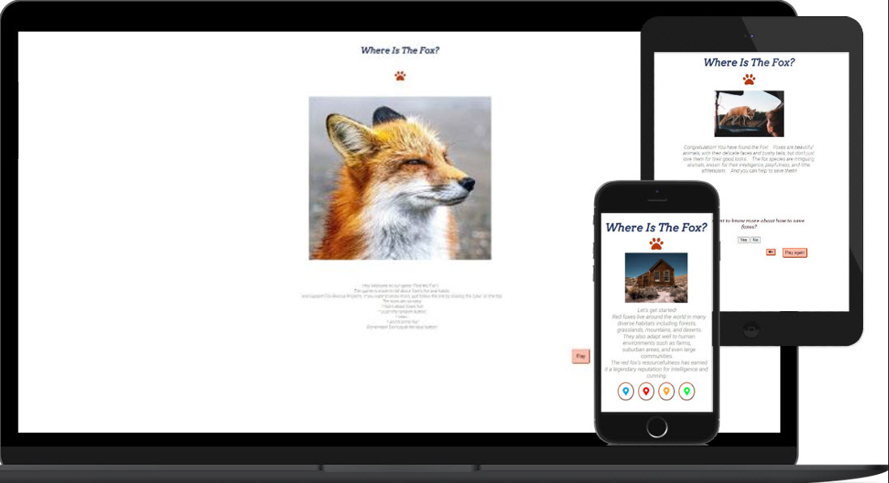

This game was created to draw attention to the problem of fox survival. It is  simple game where the user can learn interesting facts about the life and habits of foxes. For the winner gets presented a link to a helpful organization involved in rescuing foxes from fur farms and sport hunters. 
The rules of the game are quite simple.  
- By clicking on the round multi-colored buttons, the user needs to find the image of a fox.  
- There is a warning not to press the blue button, otherwise the user sees an image of space, a button appears that suggests playing again. There is also a corresponding sound and a button to turn it off.
- When the player "finds" the fox, he sees a request to repeat the game, or go to the information site.  
- Throughout the game, the user can read interesting facts about foxes, and by clicking on the "paw" logo, go to the fox help and rescue site.  

## **Table of Contents**
* [Goals](#Goals)
* Visual Design
  - [Icons](#icons)
  - [Colours](#colours)
  
* [Funtionality](#Funtionality)

* Testing  
  - [UI Testing](#ui-testing)
  - [Performance Testing](#Performance-Testing)
  - [Browser Compatibility](#Browser-Compatibility)
  - [Unfixed bugs](#unfixed-bugs)
  - [Validator Testing](#Validator-Testing)


* [Deployment](#Deployment)

* Credits
    - [Content](#Content)
    - [Media](#Media)

## **Goals**

- The goal of the game is to find the image of the fox by clicking on the round colored buttons.
- Educate users in a fun friendly manner on foxes.
- Draw attention to the fox cruelty in fox sport hunting and fur farms.
- Stimulate users to get involved or donate towards saving wildlife.

## **Visual Design**

### Style

The game is created in a simple style, where the main attention is drawn to the game elements: image, text and buttons. So the user can intuitively understand the goal and rules of the game.

### Icons


Icons were taken from the Fontaweysom Icon Library and utilised as classes in the "i" tag into the interactive buttons. They can easily be styled using other classes or IDs in the same tag.

### Colours

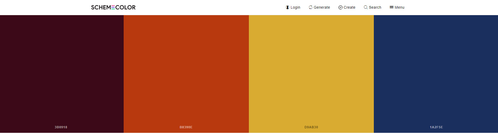

The colors used in the game emphasize the natural theme. I used [Shemecolor.com](https://www.schemecolor.com/without-fear.php) website to choose harmoniously combined colors. 

## **Funtionality**

The page consists of these sections for the user:
1. ### The Header and logo. 
  * For the header I used the "Arvo" font, because it is quite elegant and clear enough for a quick read.
  * Logo is nice paw, by clicking on which the user can go to the site and read more about how anybody can help the fox rescue organization.

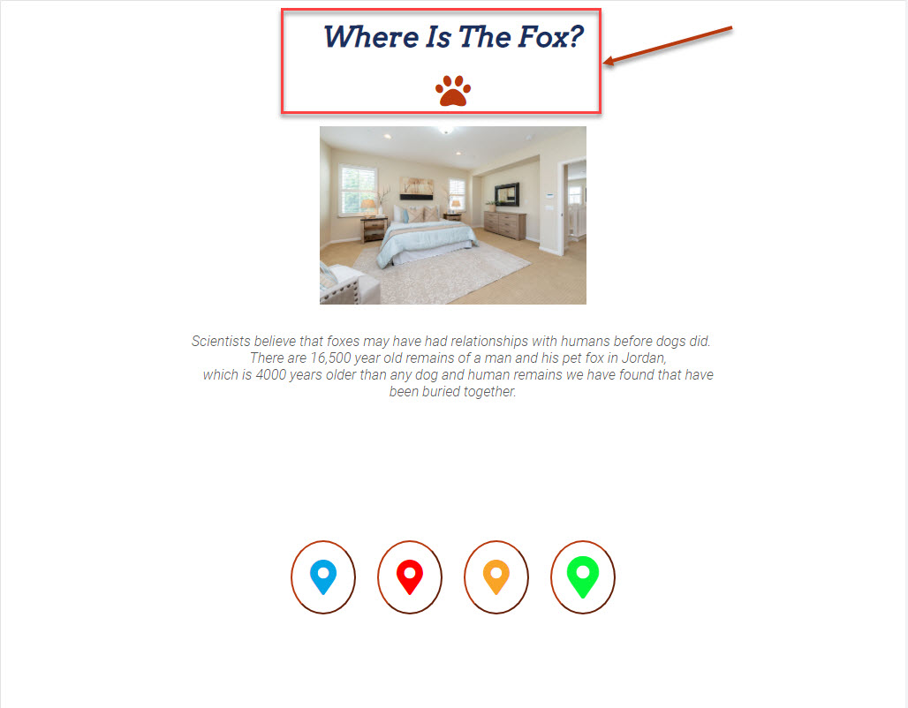

2. ### The image section. 
Which is a visual aid to help the user to feel more involved in the game.    
Photo have been reduced in size from the original, to prevent game loading delays or errors.

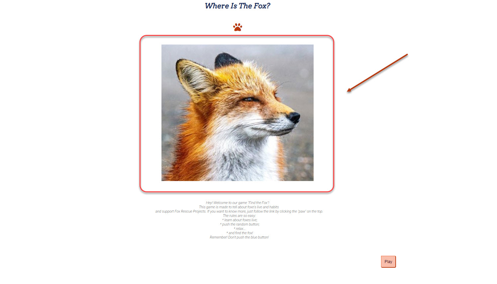

To change photos, I initially wrote several identical functions where only the image path and text changed. Then I decided to create one function by adding arguments to it and creating two lists (for photos and texts) from which the new function will randomly select items. 
This refactor function below: 

        ````
        /**
        * Removes previous image,
        * makes image visible when user push on the random button,
        * displey text under the image
        */
        function inRoom (roomImage, roomMessage) {
            clearScreen();
            roomImage.style.display = 'block';
            questionsText.textContent = roomMessage;
            imgList.splice(imgList[roomImage], 1);
            messageArray.splice(messageArray[roomMessage], 1);
        }
        ````

3. ### The storyline text section.
There are interesting facts from the foxe's life that may arouse interest in further study of this topic and the desire to help these animals.

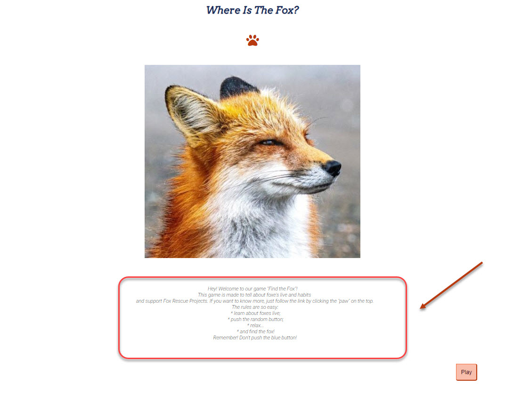

4. ### The buttons. 
There are few types of buttons:

  * Round multi-colored buttons: when used, a random photo and text appears on the screen.

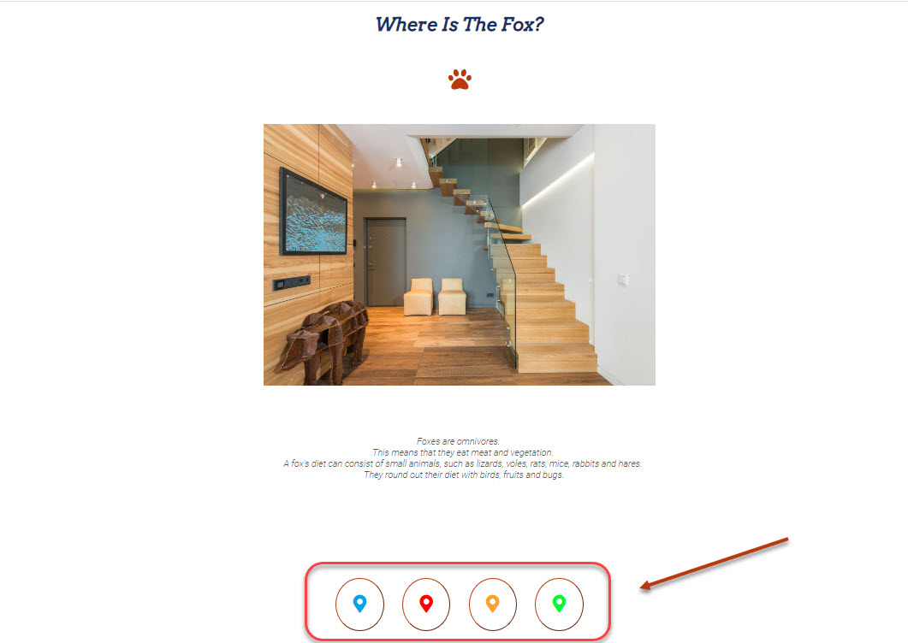

This random selection was done as using a randomise function as displayed below:

      ````function main() {
          for (let button of buttonArray) {
              button.addEventListener('click', function() {
                  let rI = imgList[Math.floor(Math.random() * imgList.length)];
                  let rM = messageArray[Math.floor(Math.random() * messageArray.length)];
                  inRoom(rI, rM);
                  if (imgList.length === 0) {
                  inFox();
                  }});
          }}    
      ```` 

  * "Play" button - a button that appears when the first page is loaded and when clicked on it, the player goes to a page with a new image and multi-colored buttons.

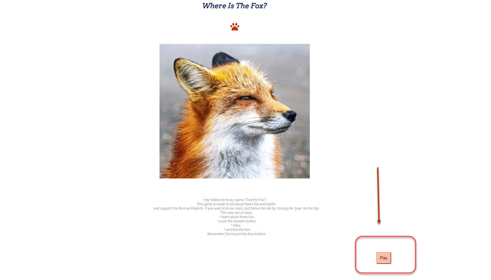

  * Question and selection buttons.

On the last page, the game ask's a question about the user's desire to learn more about foxes, if the answer is "yes", a Wikipedia window will open in a new tab, "no", a pop-up message will appear.

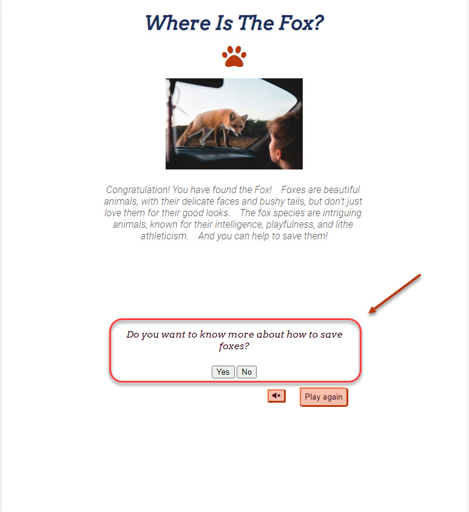

  * Mute sound and play again buttons.

When the user finish the game by floating away in space or finds the fox a sound is played to enhance the atmosphere. But if user want to mute the sond he can do this by pushing the special button. Also there is a "Play again" button on this pages, clicking on which the gamer restarts the game.

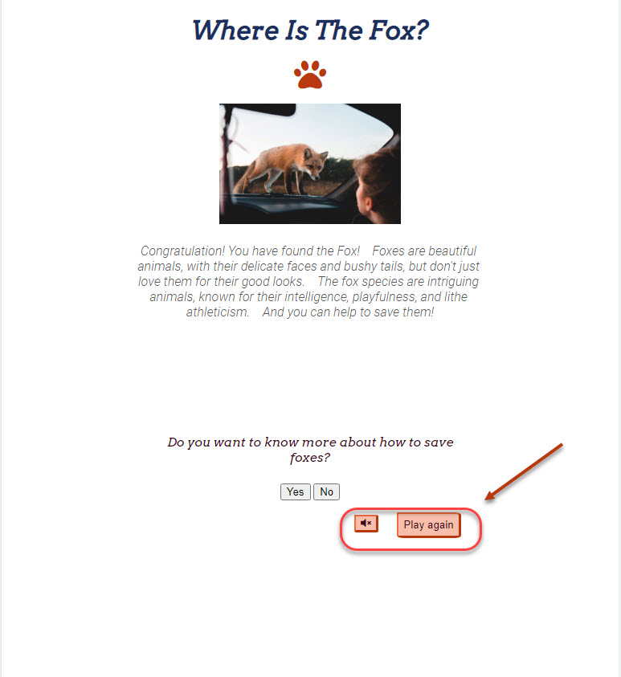

## **Testing**

### UI Testing

I tested my game appearance and functionality across multiple devices and screen sizes, below are some examples of the testing performed and the results.

* PC Monitor – Full HD 1920px x 1080px 

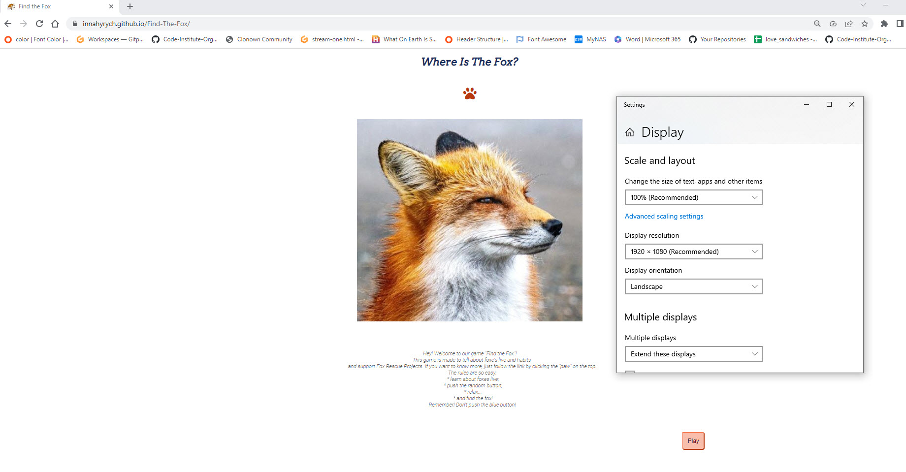

* Windows 10 Laptop 1366px x 768px

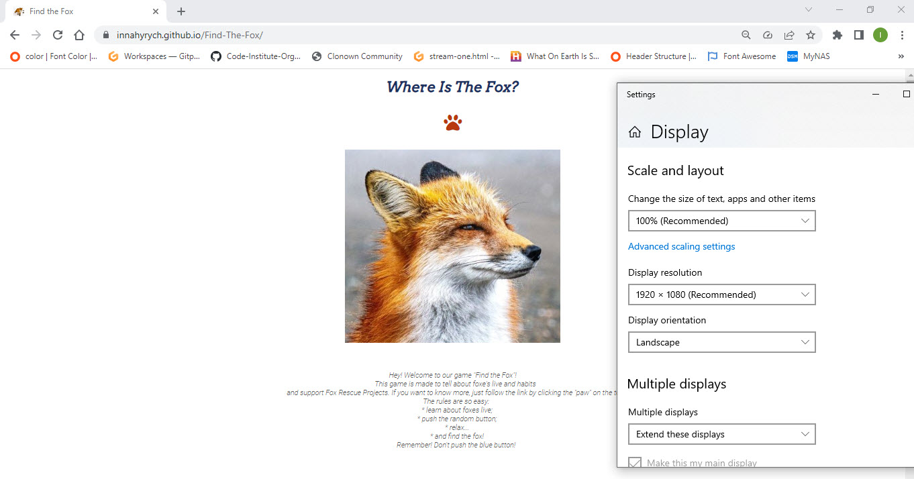

* Android OnePlus 6.3” screen

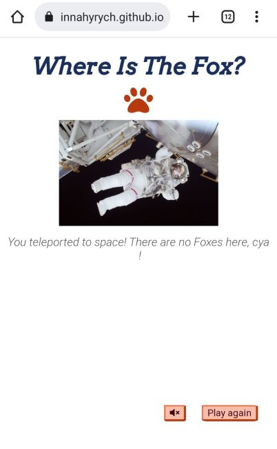

### Performance Testing

I conducted tests on how quickly my game loaded using different connections such as mobile data and home fibre via Wi-Fi in most cases the website always loaded within 2-5 seconds from mobile data and under 2 seconds when using WIFI from my home fibre connection.


### Browser Compatibility

The game was tested across the following browsers for any bugs:

- Chrome
- Firefox
- Edge

### Fixed bugs
  - Ocassional console 404 error with realfavicongenerator.net
  - Ocassional 404 error with site.webmanifest

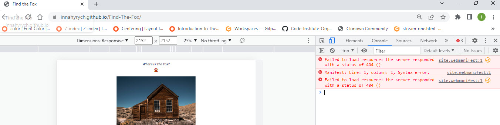

I fixed this bug when add ````crossorigin="use-credentials"```` to the ````<link rel="manifest" href="site.webmanifest" crossorigin="use-credentials">````.
I found this solution on www.medium.com site.

Testing document:
<br>						
						
https://1drv.ms/x/s!AvJgYZrLWaJmexwwAqsLAe21lZ0?e=1xlFo4

### Validator Testing

* HTML No errors were returned when passing through the official W3C validator.

In index.html I wanted use sections, but because there are no need in heading for each sections that I have, I desided use div, as validator recomended:

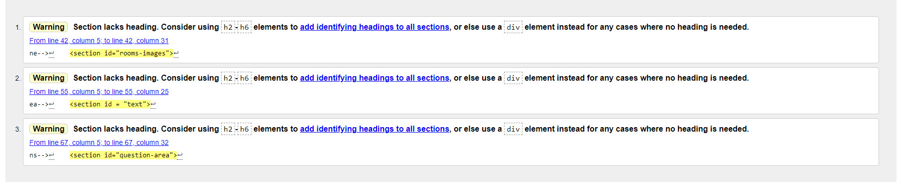

* CSS No errors were found when passing through the official W3C CSS validator. 

* Each javascript file was tested on the site for errors and functionality using the console and with JSHint.


The function:

  ````
  function main() {
    for (let button of buttonArray) {
         button.addEventListener('click', function() {
            let rI = imgList[Math.floor(Math.random() * imgList.length)];
            let rM = messageArray[Math.floor(Math.random() * messageArray.length)];
            inRoom(rI, rM);
            if (imgList.length === 0) {
            inFox();
            }});
    }}
  ````        

works flawlessly in all browsers as shown above in the section "Testing".

## **Deployment**

The site was deployed to GitHub pages. The steps to deploy are as follows:

* In the GitHub repository, navigate to the Settings tab
* From the source section drop-down menu, select the Main Branch
* Once the main branch has been selected, the page will be automatically refreshed with a detailed ribbon display to indicate the successful deployment.
* The live link can be found here - https://innahyrych.github.io/Find-The-Fox/

## **Credits**

### Content:

Information for the game Finde the Fox was taken from:
* https://www.saveafox.org/
* https://randomfunfactsonline.com/what-do-foxes-eat/                        
* http://knowledge-sastha.blogspot.com/2013/05/foxy-facts.html
* https://facts.net/fox-facts/
* https://www.factscrush.com/2021/08/facts-0about-foxes.html
* https://gifts.worldwildlife.org/gift-center/gifts/species-adoptions/red-fox.aspx

* The icons were taken from https://fontawesome.com/.
* Fonts were taken from (https://fonts.google.com/).
* Favicon created on https://realfavicongenerator.net/ site.
* https://stackoverflow.com/. 
* https://www.w3schools.com/js/ were used for help with JavaScript.
* Here I found solution for favicon bug https://medium.com/@aurelien.delogu/401-error-on-a-webmanifest-file-cb9e3678b9f3 .


### Media

All images used within this game were taken inhttps://www.pexels.com/ site.
<br>
Sounds for the game I found on https://pixabay.com/sound-effects/search/game/.
<br>
Any code utilised from a site is documented and credited within the code.