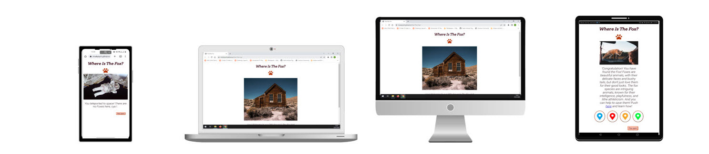
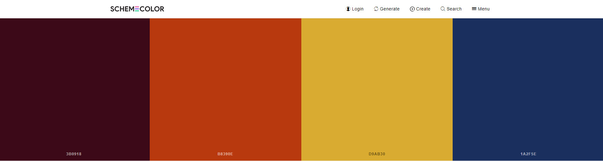
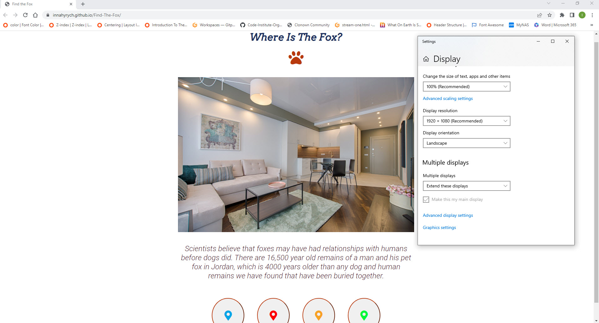
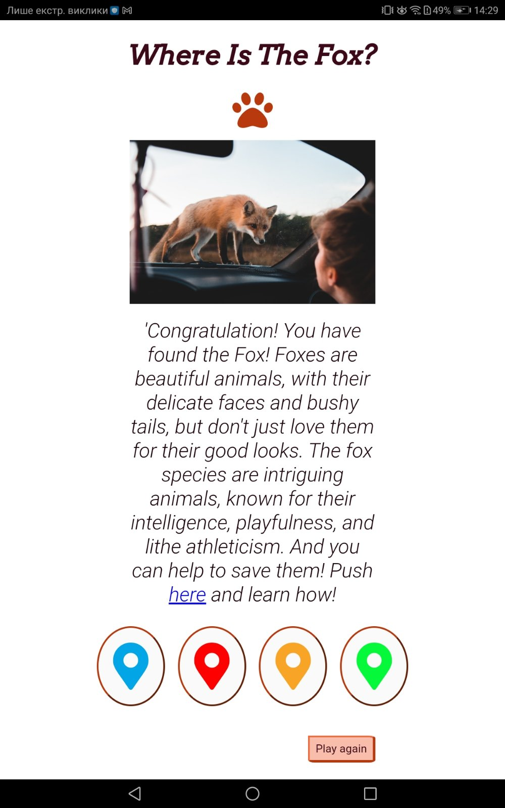
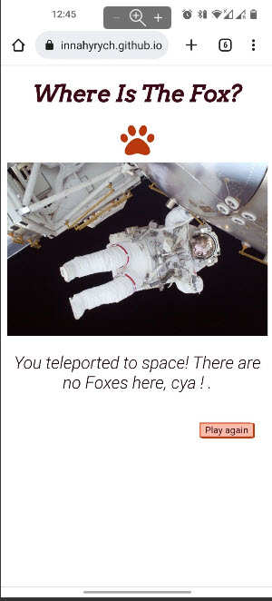
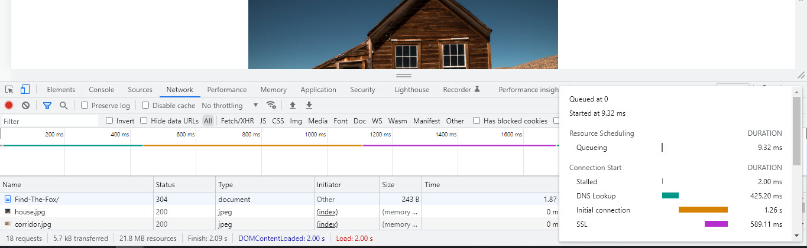
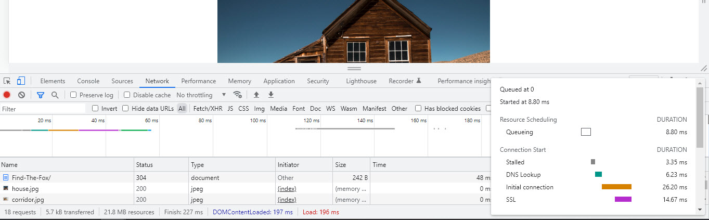
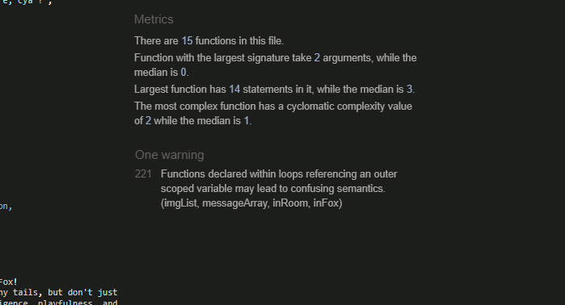

This game was created to draw attention to the problem of fox survival. It is interesting simple game, where user can learn  interesting facts about foxes life and, and also follow the links and help organizatios involved in rescuing foxes from fur farms and foxes hunted for fun.

## **Table of Contents**
* [Goals](#Goals)

* Visual Design
  - [Icons](#icons)
  - [Colours](#colours)
  
* Features

* Testing  
  - [UI Testing](#ui-testing)
  - [Performance Testing](#Performance-Testing)
  - [Browser Compatibility](#Browser-Compatibility)
  - [Validator Testing](#Validator-Testing)
  - [Fixed bugs](#fixed-bugs)

* [Deployment](#Deployment)

* Credits
    - [Content](#Content)
    - [Media](#Media)


## **Goals**

## **Visual Design**

### Icons


Icons were taken from the Fontaweysom Icon Library and utilised as classes in the <i> tag into the interactive buttons. They can easily be styled using other classes or IDs in the same tag.

### Colours



The colors used in the game emphasize the natural theme. I used [Shemecolor.com](https://www.schemecolor.com/without-fear.php) website to choose harmoniously combined colors. 

## **Features**


## **Testing**

### UI Testing

I tested my game appearance and functionality across multiple devices and screen sizes, below are some examples of the testing performed and the results.

* PC Monitor – Full HD 1920px x 1080px 



* Windows 10 Laptop 1366px x 768px


* Lenovo Tablet 10.1” screen



* Android OnePlus 6.3” screen



### Performance Testing

I conducted tests on how quickly my game loaded using different connections such as mobile data and home fibre via Wi-Fi in most cases the website always loaded within 2-5 seconds from mobile data and under 2 seconds when using WIFI from my home fibre connection.





### Browser Compatibility

The game was tested across the following browsers for any bugs:

- Chrome
- Firefox
- Edge

Testing document:
<br>
https://1drv.ms/x/s!AvJgYZrLWaJmexwwAqsLAe21lZ0?e=Fl39f5


### Validator Testing

* HTML No errors were returned when passing through the official W3C validator
* CSS No errors were found when passing through the official W3C CSS validator. 
* Each javascript file was tested on the site for errors and functionality using the console and with JSHint.



The function:

  ````for (var button of buttonArray) {
    button.addEventListener('click', function() {       
        let img = functionsArray[Math.floor(Math.random() * functionsArray.length)];
        img();
        functionsArray.splice(functionsArray[img], 1);
        console.log(functionsArray);
    });
}
````        

works flawlessly in all browsers as shown above in the section "Testing".

### Fixed bugs

## **Deployment**

The site was deployed to GitHub pages. The steps to deploy are as follows:

* In the GitHub repository, navigate to the Settings tab
* From the source section drop-down menu, select the Main Branch
* Once the main branch has been selected, the page will be automatically refreshed with a detailed ribbon display to indicate the successful deployment.
* The live link can be found here - https://innahyrych.github.io/Find-The-Fox/

## **Credits**


### Content:

Information for the game Finde the Fox was taken from:
* https://www.saveafox.org/
* https://randomfunfactsonline.com/what-do-foxes-eat/                        
* http://knowledge-sastha.blogspot.com/2013/05/foxy-facts.html
* https://facts.net/fox-facts/
* https://www.factscrush.com/2021/08/facts-0about-foxes.html
* https://gifts.worldwildlife.org/gift-center/gifts/species-adoptions/red-fox.aspx

The icons were taken from [Font Awesome](https://fontawesome.com/).
<br>
Fonts were taken from [Google Fonts](https://fonts.google.com/).
<br>
Favicon created on [favicon.io](https://favicon.io/) site.


### Media

All images used within this game were taken in [Pexels - Free Stock Photos](https://www.pexels.com/) site.
<br>
Sounds for the game I found on [pixabay.com](https://pixabay.com/sound-effects/search/game/).
<br>
Any code utilised from a site is documented and credited within the code.